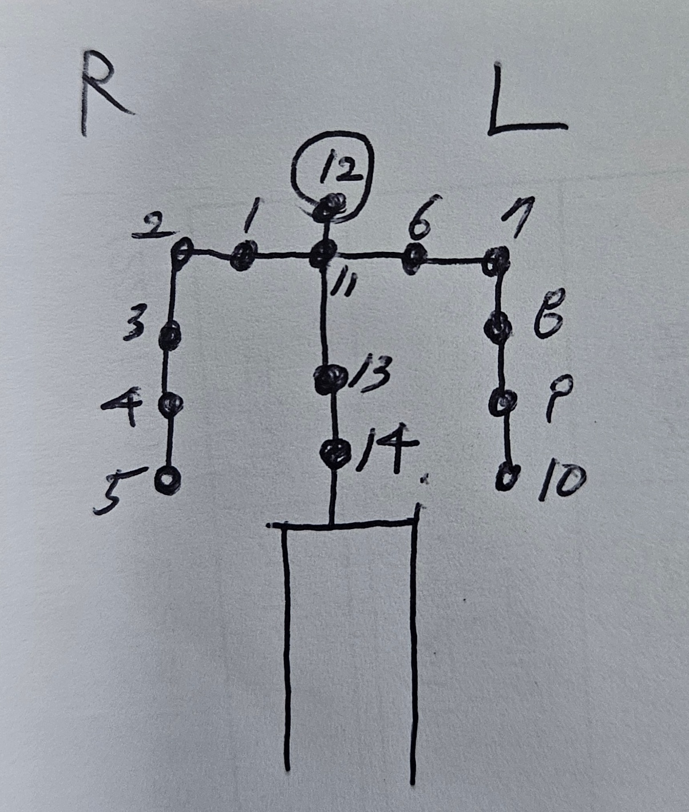
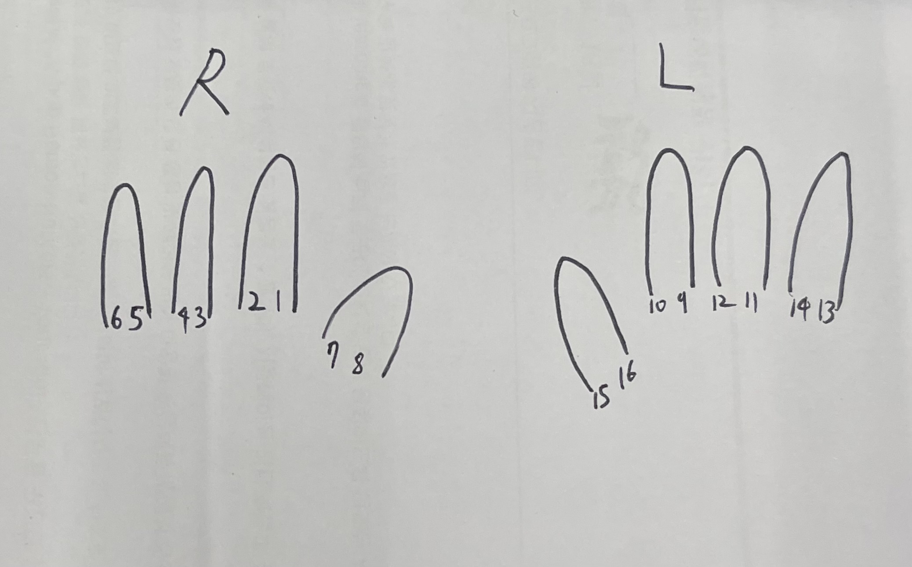

# hongdae_kist_humanoid

## 🏛️ Collaboration

This project was conducted under the supervision of Dr. Hwa-Seop Lim,
Director of the AI Research Division at KIST,
in collaboration with the TATE Lab at Hongik University.

## 🎥 Demo

<p align="center">
  
</p>

---

# Requirements
- Ubuntu 22.04 (other versions may work)
- ROS2 Humble
- MoveIt2 (Humble version)
- Python 3.10+
- Robstride motors (RS-series)
- FEETECH SCS0009 servos (for hands)
- Arduino Pro Micro (hand serial communication)

---

# Paths
Place **kist_robot_workspace** under `/home/`.  
Otherwise, you may need to update path settings for the following nodes:

- **play_and_record_csv_trajectory**
- **record_on_execute**

---

# Workflow

## 1. Launch MoveIt
```bash
$ ros2 launch kist_robot_config demo.launch.py
```

## 2. Execute Motion (and Record)
Executed joint states will be appended to:

```
/home/kist_robot_workspace/joint_log.csv
```

If execution does not run, verify controller activation:

```bash
$ ros2 control list_controllers
```

Activate the upper-body controller if needed:

```bash
$ ros2 control switch_controllers \
  --deactivate left_arm_controller right_arm_controller head_controller torso_controller \
  --activate upper_body_controller \
  --strict --activate-asap
```

## 3. Trajectory Creation
After collecting all motions (each motion ≈ 2 seconds), run the trajectory sampler:

```bash
$ ros2 run python_tools play_and_record_csv_trajectory \
  --ros-args \
  -p package_name:=kist_robot_config \
  -p controller_name:=upper_body_controller
```

This generates `joint_sample.csv` with 0.1s sampling.

## 4. Convert CSV to Python Lists
Run `csv_to_list.py` to generate Python-format lists from the sampled CSV.

## 5. Run Motions on the Real Robot
Use `player.py` to execute the generated motion sequence on hardware.

---

# Port Settings (CAN)
```bash
$ sudo slcand -o -c -s8 [PORT_FOR_RIGHT_SIDE] can0
$ sudo slcand -o -c -s8 [PORT_FOR_LEFT_SIDE]  can1
$ sudo ip link set can0 up
$ sudo ip link set can1 up
```

Hand serial port settings can be configured in **config.py**.

---

# Motor ID Mapping

<p align="center">
  
</p>

<p align="center">
  
</p>

---

# Motions

### Motion 1  
- Head left-right  
- Hands moving left-right  

### Motion 2  
- Hand waving gesture  

### Motion 3  
- Extend arm + raise index finger  

### Motion 4  
- Lift arms one by one + extend fingers  
- Head follows the moving hand  

---

# Contact
If you have any questions, feel free to reach out:

📧 **hwai566877@naver.com**
